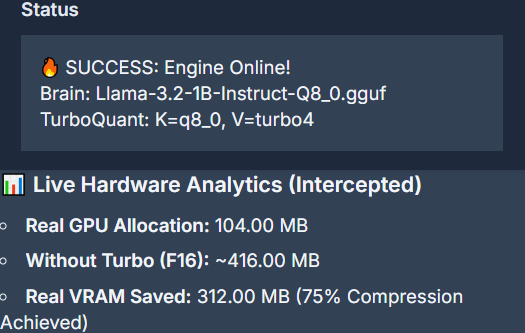
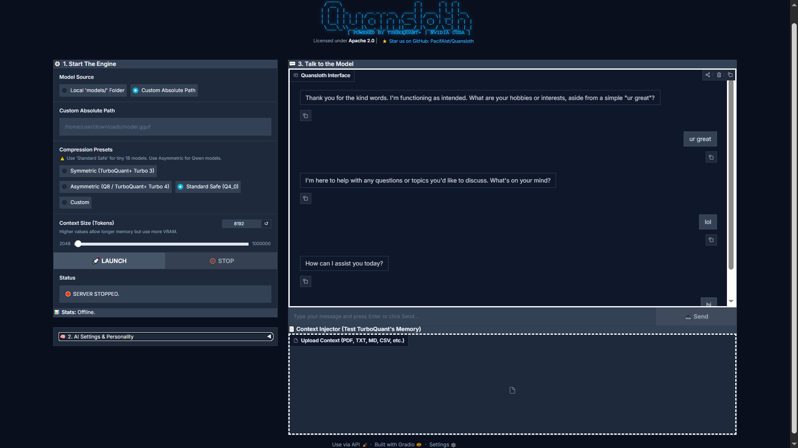

# Quansloth: TurboQuant Local AI Server

```
   ____                         _       _   _     
  / __ \                       | |     | | | |    
 | |  | |_   _  __ _ _ __   ___| | ___ | |_| |__  
 | |  | | | | |/ _` | '_ \ / __| |/ _ \| __| '_ \ 
 | |__| | |_| | (_| | | | |\__ \ | (_) | |_| | | |
  \___\_\\__,_|\__,_|_| |_||___/_|\___/ \__|_| |_|
         [ POWERED BY TURBOQUANT+ | NVIDIA CUDA ]
```

# 🦥 Quansloth: TurboQuant Local AI Server


Based on the implementation of Google's TurboQuant [(ICLR 2026)](https://research.google/blog/turboquant-redefining-ai-efficiency-with-extreme-compression/) — KV cache compression for local LLM inference, with planned extensions beyond the paper. Quansloth is a fully private, air-gapped AI server that runs massive context models natively on consumer hardware (like an RTX 3060). By bridging a custom Gradio Python frontend with a highly optimized `llama.cpp` CUDA backend, Quansloth achieves extreme memory compression, saving up to **75% of your VRAM**.



---

---

📸 Interface Preview



---

## 🖥️ OS Compatibility

- **Windows 10/11**: Fully Supported (via WSL2 Ubuntu). Features a 1-click `.bat` launcher.  
- **Linux**: Fully Supported (Native).  
- **macOS**: Not officially supported out-of-the-box (backend optimized for NVIDIA CUDA GPUs).  

---

## ✨ Features

* **TurboQuant Cache Compression:** Run 8,192+ token contexts natively on 6GB GPUs without Out-Of-Memory (OOM) crashes.
* **Live Hardware Analytics:** The UI physically intercepts the C++ engine logs to report your exact VRAM allocation and savings in real-time.
* **Context Injector:** Upload long documents (PDF, TXT, CSV, MD) directly into the chat stream to test the AI's memory limits.
* **Dual-Routing:** Auto-scan your local `models/` folder, or input custom absolute paths to load any `.gguf` file.
* **Cyberpunk UI:** A sleek, fully responsive dark-mode dashboard built for power users.

---

## 🛠️ Prerequisites

- Windows with WSL2 (Ubuntu) **OR** native Linux  
- NVIDIA GPU with updated drivers  
- Miniconda or Anaconda installed  

---

## 🚀 Installation

### 1. Prepare Python Environment

```bash
conda create -n quansloth python=3.10 -y
conda activate quansloth
```

### 2. Clone Repository

```bash
git clone https://github.com/PacifAIst/Quansloth.git
cd Quansloth
```

### 3. Run Installer

```bash
chmod +x install.sh
./install.sh
```

---

## 🎮 Usage

### Adding Models

Download `.gguf` models (e.g., Llama 3 8B) and place them in:

```
models/
```

---

### Start Server (Windows - 1 Click)

- Use `Launch_Quansloth.bat`
- Double-click → auto-launches WSL, Conda, and server

---

### Start Server (Linux / WSL)

```bash
conda activate quansloth
python quansloth_gui.py
```

---

### Connect

```
http://127.0.0.1:7860
```

---

## 🎛️ Pro Tips

- **Symmetric (Turbo3)** → Best overall compression  
- **Asymmetric (Q8/Turbo4)** → Better for Q4_K_M models  
- Monitor **Hardware Stats** for real-time VRAM savings  

---

## 📜 License & Credits

* **License:** This project is licensed under the [Apache 2.0 License](LICENSE).
* **Credits:** See [ACKNOWLEDGEMENTS.md](ACKNOWLEDGEMENTS.md) for full credits regarding the C++ backend and TurboQuant technology powering this system.

---

👤 Author
Dr. Manuel Herrador 📧 mherrador@ujaen.es
University of Jaén (UJA) - Spain

---

<p align="center">Made with ❤️ for the Local AI Community by PacifAIst</p>
